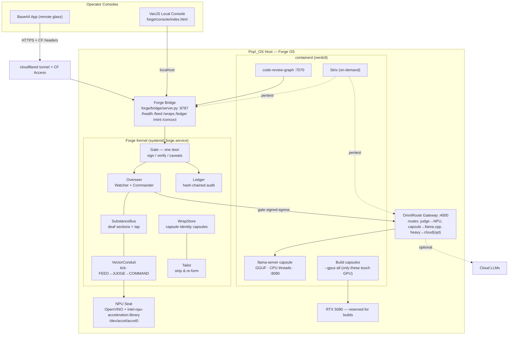

# MASTER FORGE INSTALL GUIDE — Forge OS Platform
**Target:** Pop!_OS 22.04+ · Intel Core Ultra (Arrow Lake) NPU · NVIDIA RTX 5080
**Repo:** `github.com/munnchue-gif/the-forge` (branch `master`, package `forge/`)
**Doctrine:** AI is a tool — load for the task, eject after. GPU stays free for builds. NPU judges. Nothing is thrown away. One door (Gate). LEGO everything.

---

## 0. Component Map

| Layer | Component | Source | Role in Forge OS |
|---|---|---|---|
| Kernel | `forge/fabric/*` | munnchue-gif/the-forge | Gate, Bus, Overseer, Conduit, Wrap, Tailor, Ledger |
| NPU inference | intel/intel-npu-acceleration-library + OpenVINO | pip | Judge/embeddings on Arrow Lake NPU |
| Capsule inference | ggml-org/llama.cpp | build from source | GGUF models, CPU/NPU-first, dynamic split |
| LLM gateway | diegosouzapw/OmniRoute | container | One local endpoint routing to capsules/cloud |
| Code intelligence | tirth8205/code-review-graph | container | Graph analysis of the Forge's own code |
| Security | usestrix/strix | container (on-demand) | Agentic pentest of the bridge + gateway |
| Containers | containerd + nerdctl | apt | Capsule isolation, snap-on/snap-off |
| GPU passthrough | nvidia-container-toolkit | apt | GPU only when a build capsule explicitly asks |
| Local UI | vanjs-org/van | 1 file, no build | Base44-decoupled local console |

---

## 1. Architecture (Mermaid)



Key flows: everything privileged passes the **Gate**; capsules are containers OmniRoute routes to; the **NPU judges every tick**; the **GPU is untouched** unless a build capsule requests it explicitly.

---

## 2. Base Install — Pop!_OS + Arrow Lake NPU + RTX 5080

### 2.1 Verify metal
```bash
uname -r                       # need 6.8+ (intel_vpu in-tree)
python3 --version              # need 3.11+
nvidia-smi                     # RTX 5080 present, driver 560+
ls /dev/accel/accel0 2>/dev/null || echo "NPU node missing — §2.3"
```

### 2.2 Clone + environment
```bash
mkdir -p ~/forge-os && cd ~/forge-os
git clone https://github.com/munnchue-gif/the-forge.git
cd the-forge
python3 -m venv .venv && source .venv/bin/activate
pip install --upgrade pip
pip install pytest fastapi uvicorn sse-starlette httpx
pip install -r forge/bridge/requirements.txt
python -m pytest forge/ -q        # must be green before continuing
```

### 2.3 NPU driver stack
```bash
sudo modprobe intel_vpu && lsmod | grep intel_vpu
sudo usermod -aG render $USER     # re-login after
# Level Zero NPU userspace driver:
cd /tmp
LATEST=$(curl -s https://api.github.com/repos/intel/linux-npu-driver/releases/latest | grep browser_download_url | grep -oP 'https[^"]+\.deb')
for u in $LATEST; do wget -q "$u"; done
sudo apt install -y ./intel-driver-compiler-npu_*.deb ./intel-level-zero-npu_*.deb level-zero
```

### 2.4 OpenVINO + Intel NPU Acceleration Library
```bash
source ~/forge-os/the-forge/.venv/bin/activate
pip install openvino intel-npu-acceleration-library
python - <<'EOF'
import openvino as ov
devs = ov.Core().available_devices
assert "NPU" in devs, f"NPU not visible: {devs}"
print("NPU OK:", devs)
EOF
bash forge/bind/01_setup_npu_openvino.sh   # repo's own NPU bind script
```

### 2.5 containerd + nerdctl + NVIDIA toolkit
```bash
sudo apt install -y containerd
sudo systemctl enable --now containerd
# nerdctl (docker-compatible CLI for containerd)
cd /tmp && wget -q https://github.com/containerd/nerdctl/releases/download/v2.0.2/nerdctl-full-2.0.2-linux-amd64.tar.gz
sudo tar Cxzf /usr/local nerdctl-full-2.0.2-linux-amd64.tar.gz
sudo systemctl enable --now buildkit
# NVIDIA container toolkit — GPU passthrough only for explicit build capsules
curl -fsSL https://nvidia.github.io/libnvidia-container/gpgkey | sudo gpg --dearmor -o /usr/share/keyrings/nvidia-container-toolkit-keyring.gpg
curl -fsSL https://nvidia.github.io/libnvidia-container/stable/deb/nvidia-container-toolkit.list | \
  sed 's#deb https://#deb [signed-by=/usr/share/keyrings/nvidia-container-toolkit-keyring.gpg] https://#' | \
  sudo tee /etc/apt/sources.list.d/nvidia-container-toolkit.list
sudo apt update && sudo apt install -y nvidia-container-toolkit
sudo nvidia-ctk runtime configure --runtime=containerd && sudo systemctl restart containerd
```

### 2.6 llama.cpp (CPU/NPU-first build — GPU stays free)
```bash
cd ~/forge-os
git clone https://github.com/ggml-org/llama.cpp.git && cd llama.cpp
sudo apt install -y cmake build-essential libcurl4-openssl-dev
# Deliberately NO CUDA: capsule inference must not steal the 5080.
cmake -B build -DGGML_NATIVE=ON -DLLAMA_CURL=ON
cmake --build build --config Release -j$(nproc)
sudo cp build/bin/llama-server build/bin/llama-cli /usr/local/bin/
mkdir -p ~/forge-os/models
llama-cli --version
# Pull a compact capsule brain (3B, Q4 — ~2GB, fast on CPU):
wget -O ~/forge-os/models/qwen2.5-3b-q4.gguf \
  https://huggingface.co/Qwen/Qwen2.5-3B-Instruct-GGUF/resolve/main/qwen2.5-3b-instruct-q4_k_m.gguf
```

---

## 3. Code Changes — Forge Kernel Integration

All new files snap on beside `forge/fabric/`; nothing existing is modified except two marked couplers.

### 3.1 `forge/fabric/bind/npu_seat.py` — real NPU seat (replaces HeuristicSeat at runtime)
```python
"""OpenVINO NPU seat — same protocol as HeuristicSeat, judged on silicon."""
import numpy as np
import openvino as ov


class NpuSeat:
    def __init__(self, model_path: str = None, device: str = "NPU"):
        self._core = ov.Core()
        if device not in self._core.available_devices:
            raise RuntimeError(f"{device} not available: {self._core.available_devices}")
        self._device = device
        self._compiled = None
        if model_path:
            self._compiled = self._core.compile_model(model_path, device)

    @property
    def name(self) -> str:
        return f"npu:{self._device}"

    def judge(self, vectors):
        """Drained tap vectors in, verdicts out. Falls back to cosine scoring
        when no compiled model is bound yet (still runs on NPU-adjacent path)."""
        arr = np.asarray(vectors, dtype=np.float32)
        if self._compiled is not None:
            infer = self._compiled.create_infer_request()
            out = infer.infer({0: arr})
            return list(out.values())[0].tolist()
        norms = np.linalg.norm(arr, axis=-1, keepdims=True) + 1e-9
        return (arr / norms).mean(axis=-1).tolist()
```

### 3.2 `forge/fabric/bind/capsule.py` — ejectable AI tool (load → use → eject)
```python
"""Capsule: an AI model as a hand tool. Spawned in containerd, used, ejected.
Identity lives in the Wrap, NOT the container — kill the container, keep the soul."""
import json, subprocess, time, urllib.request

NERDCTL = ["nerdctl", "--namespace", "forge"]


class Capsule:
    def __init__(self, name: str, gguf_path: str, port: int = 8080, threads: int = 8):
        self.name, self.gguf, self.port, self.threads = name, gguf_path, port, threads
        self.container = f"forge-capsule-{name}"

    def load(self, wrap_vectors=None):
        """Spawn llama-server in containerd. NO --gpus flag — GPU stays free."""
        subprocess.run(NERDCTL + [
            "run", "-d", "--rm", "--name", self.container,
            "-v", f"{self.gguf}:/model.gguf:ro",
            "-p", f"{self.port}:8080",
            "--memory", "6g", "--cpus", str(self.threads),
            "ghcr.io/ggml-org/llama.cpp:server",
            "-m", "/model.gguf", "--host", "0.0.0.0", "-t", str(self.threads),
        ], check=True)
        self._wait_healthy()
        if wrap_vectors:  # identity preservation: prime with wrap memory
            self.infer("system: restore context", context=wrap_vectors)
        return self

    def infer(self, prompt: str, context=None):
        body = json.dumps({"prompt": prompt, "n_predict": 512,
                           "context": context or []}).encode()
        req = urllib.request.Request(
            f"http://127.0.0.1:{self.port}/completion", data=body,
            headers={"Content-Type": "application/json"})
        return json.loads(urllib.request.urlopen(req, timeout=120).read())

    def eject(self, wrap_store=None):
        """Reclaim: harvest state into the wrap, then destroy the container.
        The mold IS the training — nothing thrown away."""
        if wrap_store is not None:
            wrap_store.reclaim(self.name, {"ejected_at": time.time()})
        subprocess.run(NERDCTL + ["rm", "-f", self.container], check=False)

    def _wait_healthy(self, tries=60):
        for _ in range(tries):
            try:
                urllib.request.urlopen(f"http://127.0.0.1:{self.port}/health", timeout=2)
                return
            except Exception:
                time.sleep(1)
        raise RuntimeError(f"capsule {self.name} never became healthy")
```

### 3.3 `forge/fabric/bind/splitter.py` — dynamic model splitting
```python
"""Dynamic split: judge stays on NPU, generation on CPU capsule, and ONLY
an explicitly gate-approved heavy task may borrow the GPU."""
import subprocess


def free_vram_mb() -> int:
    out = subprocess.check_output(
        ["nvidia-smi", "--query-gpu=memory.free", "--format=csv,noheader,nounits"])
    return int(out.decode().split()[0])


def plan_split(task: dict) -> dict:
    """Returns placement plan: {'judge': 'npu', 'generate': 'cpu'|'gpu', 'layers_gpu': n}"""
    plan = {"judge": "npu", "generate": "cpu", "layers_gpu": 0}
    if task.get("heavy") and task.get("gate_approved") and free_vram_mb() > 12000:
        plan["generate"] = "gpu"
        plan["layers_gpu"] = 999  # llama.cpp -ngl: offload all layers
    return plan
```

### 3.4 Coupler edits (the only two touches to existing code)
In `forge/__main__.py`, swap the seat construction:
```python
# BEFORE: seat = HeuristicSeat()
try:
    from forge.fabric.bind.npu_seat import NpuSeat
    seat = NpuSeat()
    print("[forge] seat: NPU (Arrow Lake)")
except Exception as e:
    from forge.fabric.conduit import HeuristicSeat
    seat = HeuristicSeat()
    print(f"[forge] seat: heuristic fallback ({e})")
```
In `forge/bridge/server.py`, add one route so consoles can command capsules through the Gate:
```python
@app.post("/capsule/{name}/{action}")   # action: load | eject
async def capsule_ctl(name: str, action: str, request: Request):
    kernel.gate.verify(await request.json())          # one door — always
    from forge.fabric.bind.capsule import Capsule
    cap = Capsule(name, f"/home/forge/forge-os/models/{name}.gguf")
    return cap.load().__dict__ if action == "load" else (cap.eject(kernel.wraps) or {"ejected": name})
```

---

## 4. Per-Repository Configuration

### 4.1 OmniRoute — LLM gateway (:4000)
```bash
mkdir -p ~/forge-os/omniroute && cd ~/forge-os/omniroute
git clone https://github.com/diegosouzapw/OmniRoute.git .
cat > config.yaml <<'EOF'
server: { port: 4000, host: 127.0.0.1 }   # localhost only — bridge is the door
routes:
  - name: judge      # tiny/fast → NPU-adjacent capsule
    match: { tag: judge }
    target: http://127.0.0.1:8080/v1
  - name: capsule    # default generation → local llama.cpp
    match: { default: true }
    target: http://127.0.0.1:8080/v1
  - name: heavy      # optional cloud escape hatch (disabled until keyed)
    match: { tag: heavy }
    target: ${CLOUD_LLM_URL:-http://127.0.0.1:8080/v1}
fallback: capsule
logging: { level: info, file: /var/log/forge/omniroute.log }
EOF
nerdctl --namespace forge build -t forge/omniroute .
nerdctl --namespace forge run -d --restart=always --name omniroute \
  -p 127.0.0.1:4000:4000 -v $PWD/config.yaml:/app/config.yaml:ro forge/omniroute
```

### 4.2 code-review-graph — code intelligence (:7070)
```bash
mkdir -p ~/forge-os/crg && cd ~/forge-os/crg
git clone https://github.com/tirth8205/code-review-graph.git .
nerdctl --namespace forge build -t forge/crg .
nerdctl --namespace forge run -d --restart=always --name crg \
  -p 127.0.0.1:7070:7070 \
  -v ~/forge-os/the-forge:/workspace:ro forge/crg --target /workspace/forge
# Weekly self-review, findings onto the bus via the bridge:
( crontab -l 2>/dev/null; echo '0 6 * * 1 curl -s http://127.0.0.1:7070/analyze | curl -s -X POST -d @- http://127.0.0.1:8787/findings' ) | crontab -
```

### 4.3 Strix — agentic security (on-demand, never resident)
```bash
mkdir -p ~/forge-os/strix && cd ~/forge-os/strix
git clone https://github.com/usestrix/strix.git .
nerdctl --namespace forge build -t forge/strix .
cat > ~/forge-os/bin/forge-pentest <<'EOF'
#!/usr/bin/env bash
# Strix is itself a capsule: load, attack, report, eject.
nerdctl --namespace forge run --rm --name strix \
  -e STRIX_LLM_URL=http://127.0.0.1:4000/v1 \
  --network host forge/strix \
  --target http://127.0.0.1:8787 --target http://127.0.0.1:4000 \
  --report /tmp/strix-report.json
curl -s -X POST -d @/tmp/strix-report.json http://127.0.0.1:8787/findings
EOF
chmod +x ~/forge-os/bin/forge-pentest
```

### 4.4 intel-npu-acceleration-library — direct NPU LLM path (optional judge upgrade)
```python
# forge/fabric/bind/npu_llm.py — tiny instruct model living ON the NPU
from intel_npu_acceleration_library import NPUModelForCausalLM
from transformers import AutoTokenizer

MODEL = "Qwen/Qwen2.5-0.5B-Instruct"
model = NPUModelForCausalLM.from_pretrained(MODEL, use_cache=True).eval()
tok = AutoTokenizer.from_pretrained(MODEL)

def npu_answer(prompt: str, max_new_tokens: int = 128) -> str:
    ids = tok(prompt, return_tensors="pt").input_ids
    out = model.generate(ids, max_new_tokens=max_new_tokens)
    return tok.decode(out[0], skip_special_tokens=True)
```
```bash
pip install intel-npu-acceleration-library transformers torch --extra-index-url https://download.pytorch.org/whl/cpu
```

---

## 5. Model Hot-Swap (load → use → eject, identity preserved)

`forge/fabric/bind/hotswap.py`:
```python
"""Hot-swap: capsules change like suits in the Wardrobe; the wrap keeps the soul."""
from forge.fabric.bind.capsule import Capsule
from forge.fabric.bind.splitter import plan_split

MODELS = {
    "scout":   ("~/forge-os/models/qwen2.5-3b-q4.gguf", 8),   # fast default
    "builder": ("~/forge-os/models/qwen2.5-coder-7b-q4.gguf", 12),
}
_active = {"capsule": None}


def swap_to(name: str, kernel, task=None):
    plan = plan_split(task or {})
    if _active["capsule"]:
        _active["capsule"].eject(kernel.wraps)            # reclaim first — nothing lost
    path, threads = MODELS[name]
    wrap = kernel.wraps.restore(name)                      # identity: prior wrap vectors
    cap = Capsule(name, path, threads=threads).load(wrap_vectors=wrap)
    _active["capsule"] = cap
    kernel.ledger.append({"event": "hotswap", "to": name, "plan": plan})
    return cap
```
Rules enforced: eject **always** reclaims into the WrapStore before the container dies; load **always** restores from the wrap. The container is disposable; the wrap is not.

---

## 6. Security Setup (Strix + hardening)

1. **Attack surface**: only `cloudflared` egress + localhost ports (8787, 4000, 8080, 7070 all bound to 127.0.0.1). Verify: `ss -tlnp | grep -v 127.0.0.1` should show nothing forge-owned.
2. **Gate on every verb**: bridge routes call `kernel.gate.verify()` before acting (see §3.4). Fix the two known Gate gaps first: add a `nonce` field to signed payloads (kills false-replay) and hash fields before joining (kills the `|` delimiter shift).
3. **Run Strix monthly + after any bridge change**: `~/forge-os/bin/forge-pentest`. Findings land on `/findings` → the bus → tasks.
4. **Firewall**: `sudo ufw default deny incoming && sudo ufw allow out 443 && sudo ufw enable`.
5. **Containers**: the `forge` containerd namespace runs everything `--rm`, memory-capped, read-only model mounts, and **no** `--gpus` except build capsules.

## 7. Code Intelligence (code-review-graph)
Configured in §4.2. It graphs `forge/` weekly; findings post to the bridge and become ForgeTasks. To review the UI repo too, add a second `-v ~/forge-os/the-forge-ui:/ui:ro` mount and cron line.

## 8. LLM Gateway (OmniRoute)
Configured in §4.1. Every Forge component that needs an LLM speaks **only** to `http://127.0.0.1:4000/v1` (OpenAI-compatible). Swapping models, adding cloud, or A/B routing is a config.yaml change — zero code changes anywhere else. That's the socket.

## 9. Container Optimization
- containerd + nerdctl, single `forge` namespace: `nerdctl --namespace forge ps`.
- Capsules are `--rm` (ephemeral by doctrine), CPU/memory capped, models mounted read-only.
- GPU: `nvidia-container-toolkit` configured, but **only** build capsules use it:
  `nerdctl --namespace forge run --rm --gpus all forge/builder ...`
- Image hygiene weekly: `nerdctl --namespace forge system prune -f`.
- Snapshotter: default overlayfs is right for this workload; nothing exotic needed.

---

## 10. Decoupling from Base44

The Base44 app becomes **optional glass**. Local-first replacement:

### 10.1 VanJS local console — `forge/console/index.html` (one file, no build step)
```html
<!doctype html><html><head><meta charset="utf-8"><title>Forge Console</title>
<script src="https://cdn.jsdelivr.net/gh/vanjs-org/van/public/van-1.5.5.nomodule.min.js"></script>
<style>body{background:#0a0e17;color:#cfe8ee;font-family:monospace;padding:2rem}
h1{color:#f0a500}.ok{color:#3ddc84}.bad{color:#ff5555}button{background:#111827;color:#22d3ee;border:1px solid #164e63;padding:.5rem 1rem;cursor:pointer;margin-right:.5rem}</style>
</head><body><script>
const {div,h1,p,pre,button,span} = van.tags, B = "http://127.0.0.1:8787";
const health = van.state("…"), feed = van.state([]);
const refresh = async () => { try { const r = await (await fetch(B+"/health")).json();
  health.val = `booted:${r.booted} contract:${r.contract_version}`; } catch { health.val = "OFFLINE"; } };
refresh(); setInterval(refresh, 10000);
const es = new EventSource(B+"/feed");
es.onmessage = e => { feed.val = [e.data, ...feed.val].slice(0,50); };
const cap = (n,a) => fetch(`${B}/capsule/${n}/${a}`,{method:"POST",body:"{}"});
van.add(document.body, div(
  h1("THE FORGE — local console"),
  p("bridge: ", span({class:()=>health.val==="OFFLINE"?"bad":"ok"}, health)),
  button({onclick:()=>cap("scout","load")},"load scout"),
  button({onclick:()=>cap("scout","eject")},"eject scout"),
  button({onclick:()=>cap("builder","load")},"load builder"),
  ()=>pre(feed.val.join("\n"))
));
</script></body></html>
```
Serve it: `python3 -m http.server 8090 -d ~/forge-os/the-forge/forge/console` → `http://localhost:8090`.

### 10.2 Data decoupling
- **Deck controls**: replace the Base44 `ForgeControl` poll with a local file the console (or anything) writes: `~/forge-os/state/controls.json`; DeckBridge reads it with the same changed-only diff logic. Base44 poll becomes an optional second source.
- **Board/tasks/wraps**: already exportable — the bridge owns `/wraps`, `/ledger`, `/findings`; persist to SQLite at `~/forge-os/state/forge.db` (stdlib `sqlite3`, no new deps).
- **Result**: unplug the internet and the Forge OS is fully operable. Base44 snaps back on whenever the tunnel is up — it's a socket, not a spine.

---

## 11. Snap-on / Snap-off Matrix (LEGO law)

| Piece | Snap on | Snap off | Survives removal? |
|---|---|---|---|
| NPU seat | auto-detected in `__main__` | falls back to HeuristicSeat | yes |
| Any capsule | `swap_to("name", kernel)` | `.eject()` → wrap reclaimed | identity kept in wrap |
| OmniRoute | start container | stop it; components hit llama.cpp direct | yes |
| code-review-graph | start container + cron | remove cron + container | yes |
| Strix | on-demand script | never resident | yes |
| GPU | `--gpus all` per build capsule | omit flag | GPU always free otherwise |
| Base44 glass | cloudflared up | tunnel down; VanJS console remains | yes |
| VanJS console | serve one HTML file | delete it | yes |

Every interface is HTTP or a Python protocol class — no piece imports another piece's internals.

---

## 12. Boot Order + systemd

```bash
sudo mkdir -p /var/log/forge && sudo chown $USER /var/log/forge
mkdir -p ~/.config/systemd/user
cat > ~/.config/systemd/user/forge.service <<'EOF'
[Unit]
Description=THE FORGE kernel
[Service]
WorkingDirectory=%h/forge-os/the-forge
ExecStart=%h/forge-os/the-forge/.venv/bin/python -m forge
Restart=on-failure
RestartSec=3
[Install]
WantedBy=default.target
EOF
cat > ~/.config/systemd/user/forge-bridge.service <<'EOF'
[Unit]
Description=THE FORGE bridge
After=forge.service
[Service]
WorkingDirectory=%h/forge-os/the-forge
ExecStart=%h/forge-os/the-forge/.venv/bin/python -m forge.bridge.server
Restart=on-failure
[Install]
WantedBy=default.target
EOF
systemctl --user daemon-reload
systemctl --user enable --now forge forge-bridge
```
Order: containerd (system) → forge kernel → bridge → OmniRoute/CRG containers (restart=always) → cloudflared (optional glass).

---

## 13. Troubleshooting

| Symptom | Check | Fix |
|---|---|---|
| `/dev/accel/accel0` missing | `lsmod \| grep intel_vpu` | `sudo modprobe intel_vpu`; kernel < 6.8 → upgrade; re-login after `usermod -aG render` |
| OpenVINO sees no NPU | `python -c "import openvino as ov; print(ov.Core().available_devices)"` | reinstall Level Zero .debs (§2.3), reboot |
| Capsule never healthy | `nerdctl --namespace forge logs forge-capsule-scout` | GGUF path wrong / OOM — lower `--memory` model or use smaller quant |
| GPU busy during inference | `nvidia-smi` shows llama | you built with CUDA — rebuild §2.6 without it |
| Bridge 401 via Base44 | CF Access headers | re-enter service token in app settings; test `curl -H "CF-Access-Client-Id: …" …/health` |
| Feed silent | `curl -N http://127.0.0.1:8787/feed` | bridge up but kernel not booted → `systemctl --user status forge` |
| Gate false replay | two identical legit actions rejected | implement nonce (§6.2) — known gap |
| OmniRoute route misses | `/var/log/forge/omniroute.log` | tag mismatch in config.yaml; `fallback: capsule` catches all |
| containerd GPU error | `nerdctl run --gpus all nvidia/cuda:12.4.0-base nvidia-smi` | `sudo nvidia-ctk runtime configure --runtime=containerd && sudo systemctl restart containerd` |
| Hot-swap loses context | wrap empty | ensure `.eject(kernel.wraps)` runs before container kill; check `/wraps` on bridge |

---

## 14. Acceptance Checklist
- [ ] `python -m pytest forge/ -q` green
- [ ] `ov.Core().available_devices` includes NPU
- [ ] `systemctl --user status forge forge-bridge` both active
- [ ] `curl localhost:8787/health` → booted:true
- [ ] `swap_to("scout")` loads, answers, ejects; `/wraps` shows reclaim
- [ ] `nvidia-smi` idle during capsule inference
- [ ] VanJS console operates with cloudflared stopped (Base44 fully decoupled)
- [ ] `forge-pentest` report reviewed, findings triaged

*The Forge doesn't get smarter by getting bigger. It gets smarter by being structured. Baptism, not code.*